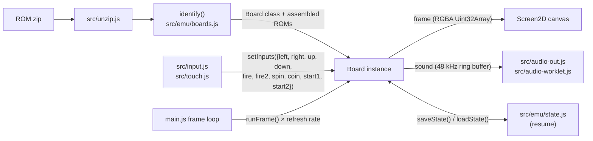
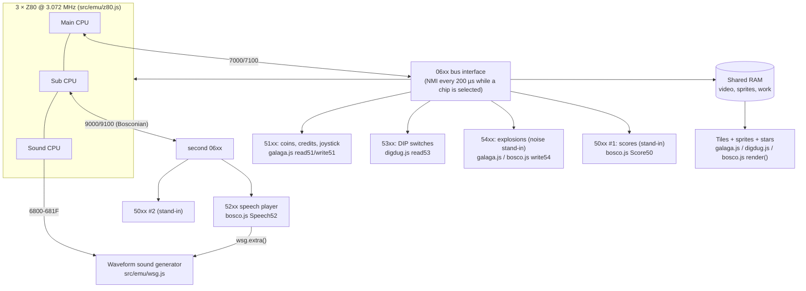
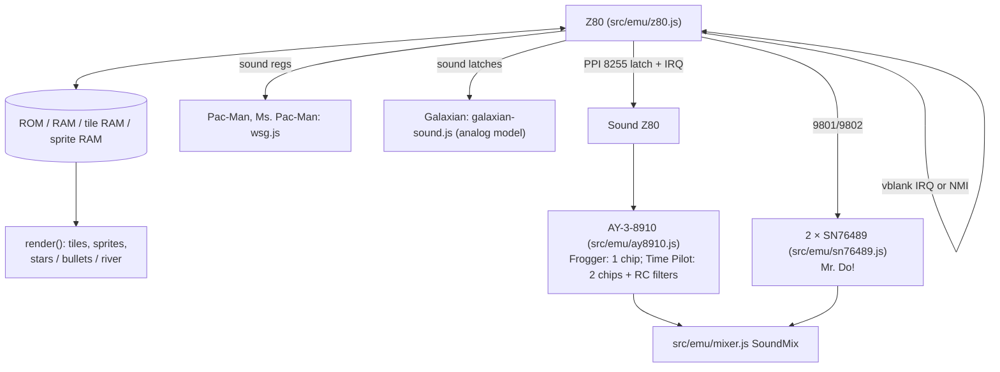
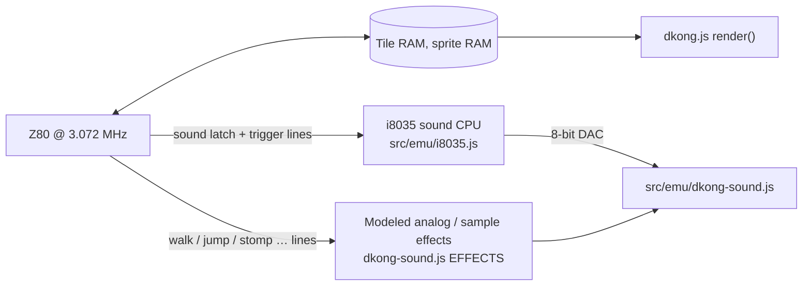
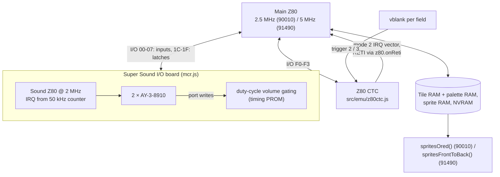
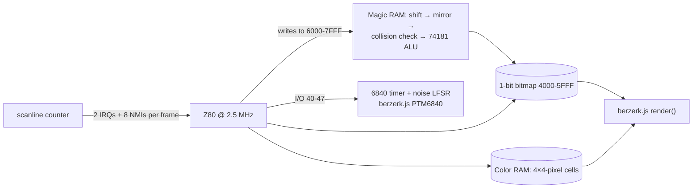

# z80js

A touch-first emulator for Z80-based arcade boards of the late 1970s and early 80s, for
phones and desktop. Plain HTML, CSS and JavaScript modules, with no dependencies and no
build step. It shares its app shell (touch controls, settings, game library, audio) with
[6502js](https://github.com/madmonk13/6502js), the Atari 2600 emulator it was forked from.

No ROMs are included: add your own ROM sets, the zips used by MAME. A set is recognized
by its chips' file names, so the zip's own name doesn't matter.

## Supported games

| Game | Board | MAME sets | Status |
|---|---|---|---|
| Galaga (1981) | Namco Galaga: 3 Z80s, custom I/O chips, waveform sound | `galagao` | **Tested:** boots, attract mode, coin, start and play |
| | | `galaga`, `galagamw`, `galagamk`, `galagamf`, `gallag` | Recognized, not yet tested |
| Pac-Man (1980) | Namco Pac-Man: 1 Z80, waveform sound | `pacman` (Midway) | **Tested:** boots, attract mode, coin, start and play |
| Galaxian (1979) | Namco Galaxian: 1 Z80, analog sound | `galaxian` | **Tested:** boots, attract mode, coin, start and play |
| Donkey Kong (1981) | Nintendo: Z80, an 8035 sound CPU with a DAC, analog effects | `dkong` (US set 1) | **Tested:** boots, attract mode, coin, start and play |
| Ms. Pac-Man (1981) | Pac-Man board plus Midway's add-on board (its ROMs are stored scrambled; z80js unscrambles them) | `mspacman` | **Tested:** boots, attract mode, coin, start and play |
| Frogger (1981) | Konami: Galaxian-style video, a second Z80 and an AY-3-8910 for sound | `frogger` | **Tested:** boots, attract mode, coin, start and play |
| Donkey Kong Jr. (1982) | Donkey Kong board with a second tile bank and different sound wiring | `dkongjr` (US) | **Tested:** boots, attract mode, coin, start and play |
| Dig Dug (1982) | Galaga board design plus a ROM-based background playfield, the 53xx switch reader and an EAROM | `digdug` (rev 2) | **Tested:** boots, attract mode, coin, start and play |
| | | `digdugb`, `digdugat` | Recognized, not yet tested |
| Time Pilot (1982) | Konami: 1 Z80, tiles and sprites re-used down the screen; a sound Z80 with two AY-3-8910s | `timeplt` | **Tested:** boots, attract mode, coin, start and play |
| | | `timepltc`, `timeplta` | Recognized, not yet tested |
| Bosconian (1981) | Galaga design plus two 06xx, two 50xx score chips, 52xx speech and a scrolling playfield with radar | `bosco` (new version) | **Tested:** boots, attract mode, coin, start and play, speech |
| Berzerk (1980) | Stern: 1 Z80, one-bit bitmap with "magic RAM" shifter/ALU and collision detection, 6840 sound effects | `berzerk` (set 1) | **Tested:** boots, attract mode, coin, start and play (no speech: see below) |
| | | `berzerk1` | Recognized, not yet tested |
| Frenzy (1982) | Berzerk board, bigger program | `frenzy` | **Tested:** boots, coin, start and play (no speech) |
| Pooyan (1982) | Konami: Time Pilot's sound board, 4-bit tiles and sprites | `pooyan` | **Tested:** boots, attract mode, coin, start and play |
| Scramble (1981) | Konami: Galaxian-style video, two AY-3-8910s, a protection check | `scramble` | **Tested:** boots, attract mode, coin, start and play |
| Amidar (1981) | Konami: as Scramble, different map and background color | `amidar` | **Tested:** boots, attract mode, coin, start and play |
| Moon Cresta (1980) | Nichibutsu: Galaxian board with graphics banking, encrypted program | `mooncrst` | **Tested:** boots, attract mode, coin, start and play |
| Jr. Pac-Man (1983) | Pac-Man board, encrypted program, scrolling 54-row playfield, banks | `jrpacman` | **Tested:** boots, attract mode, coin, start and play |
| Xevious (1982) | Galaga family: two scrolling tile layers, 3-bit sprites, terrain-map ROMs | `xevious` (Namco) | **Tested:** boots, attract mode, coin, start and play |
| Piranha (1981) | Pac-Man board, program and graphics with swapped lines | `piranha` | **Tested:** boots, coin, start and play |
| Crush Roller (1981) | Pac-Man board with a protection device | `crush` (Kural Samno) | **Tested:** boots, coin, start and play |
| Kick (1981) | Bally Midway MCR (90009 CPU board), dial | `kick` (upright) | **Tested:** boots, attract mode, coin, start and play |
| Rally-X (1980) | Namco: 1 Z80, waveform sound, scrolling playfield, radar panel | `rallyx` | **Tested:** boots, attract mode, coin, start and play |
| Warp & Warp (1981) | Namco: Intel 8080 (run on the Z80 core), 1-bit characters with 8-bit color, a hardware ball | `warpwarp` | **Tested:** boots, attract mode, coin, start and play |
| Mappy (1983) | Namco: two Motorola 6809s, 58xx I/O chips, 8-voice 15xx waveform sound, scrolling map | `mappy` (US) | **Tested:** boots, attract mode, coin, start and play |
| Centipede (1980) | Atari: MOS 6502, tiles and 8x16 sprites with palette RAM, POKEY sound, trackball | `centiped` (revision 3) | **Tested:** boots, attract mode, coin, start and play |
| Phoenix (1980) | Amstar: Intel 8085 (run on the Z80 core), two tile layers in banked video RAM, analog sound and a melody chip | `phoenix` (Amstar) | **Tested:** boots, attract mode, coin, start and play |
| Mr. Do! (1982) | Universal: 1 Z80, two tile layers (one scrolling), two SN76489s | `mrdo` | **Tested:** boots, attract mode, coin, start and play |
| | | `mrdot` | Recognized, not yet tested |
| Satan's Hollow (1981) | Bally Midway MCR (90010 CPU board): Z80 with a Z80 CTC, Super Sound I/O (Z80, two AY-3-8910s) | `shollow` | **Tested:** boots, attract mode, coin, start and play |
| | | `shollow2` | Recognized, not yet tested |
| Tron (1982) | MCR, as Satan's Hollow, plus the aiming dial | `tron` (set 1) | **Tested:** boots, attract mode, coin, start and play |
| Tapper (1983) | MCR (91490 CPU board): 5 MHz Z80, bigger sprites with their own palettes | `tapper` (Budweiser) | **Tested:** boots, attract mode, coin, start and play |
| Super Xevious (1984) | Xevious board, harder program | `sxevious` | **Tested:** boots, attract mode, coin, start and play |
| Puck Man (1980) | Namco's Japanese Pac-Man, program in eight 2K chips | `puckman` | **Tested:** boots, attract mode, coin, start and play |
| Pac-Man Plus (1982) | Pac-Man board, encrypted program (z80js decrypts it) | `pacplus` | **Tested:** boots, attract mode, coin, start and play |
| Super Cobra (1981) | Konami: Scramble board with a different map | `scobra` | **Tested:** boots, attract mode, coin, start and play |
| Space Invaders (1978) | Midway/Taito: Intel 8080 (run on the Z80 core), one-bit bitmap, barrel shifter, discrete sound, color overlay | `invaders` | **Tested:** boots, attract mode, coin, start and play |
| Lady Bug (1981) | Universal: 1 Z80, tiles, 8x8 and 16x16 sprites, two SN76489s, coin-triggered NMI | `ladybug` | **Tested:** boots, attract mode, coin, start and play |
| 1942 (1984) | Capcom: banked Z80, scrolling 16x16 background, stacked sprites, sound Z80 with two AY-3-8910s | `1942` | **Tested:** boots, attract mode, coin, start and play |
| Mr. Do's Castle (1983) | Universal: two Z80s talking through a latch, 4-bit tiles with priority, four SN76489s | `docastle` | **Tested:** boots, attract mode, coin, start and play |
| Popeye (1982) | Nintendo: encrypted Z80, 512x448 raster, background bitmap, protection shifter, AY-3-8910 | `popeye` (revision D) | **Tested:** boots, attract mode, coin, start and play |
| Pengo (1982) | Sega: Pac-Man video and sound, Sega-encrypted Z80, graphics and color banks | `pengo` (set 1) | **Tested:** boots, attract mode, coin, start and play |
| Bomb Jack (1984) | Tehkan: Z80, background pictures from a map ROM, 16x16 and 32x32 sprites, palette RAM, sound Z80 with three AY-3-8910s | `bombjack` | **Tested:** boots, self-test, attract mode, coin, start and play |
| Mario Bros. (1983) | Nintendo: Donkey Kong's design with a scrolling tile layer (the POW bump) and an 8039 driving a DAC | `mario` (MAME 2003 naming; `marioo` in newer MAME) | **Tested:** boots, attract mode, coin, start and play |

Galaga's older dumps that name the chips by board location (`04m_g01.bin` … `5n.bin`) are
recognized too; that's the tested Galaga set. Gallag's extra Z80 stood in for Namco's
custom chips, which z80js emulates directly, so that CPU's ROM is ignored.

Not supported: **Gatsbee** (Galaga hack with switchable graphics) and the many other
Galaxian-board clones and conversions, each of which changes the hardware a little.

## Controls

The touch layout follows the game:

- **Galaga, Galaxian:** the left half is a left/right pad, the right half is fire.
- **Donkey Kong, Donkey Kong Jr.:** the left half is a 4-way joystick, the right half is jump.
- **Bosconian, Berzerk, Frenzy:** the left half is an 8-way joystick, the right half is fire.
- **Scramble, Xevious:** an 8-way joystick; the right half's bottom fires and its top drops
  bombs (Scramble's Bomb, Xevious's Blaster).
- **Moon Cresta:** a left/right pad and fire. **Pooyan:** the stick moves Mama up and down;
  fire shoots. **Amidar:** a 4-way joystick and the jump button. **Jr. Pac-Man, Piranha, Crush Roller:** stick only. **Rally-X:** a 4-way stick;
  fire lays a smoke screen. **Warp & Warp:** 4-way stick and fire. **Mappy:** left/right,
  and the button opens and closes doors.
- **Centipede:** the stick rolls the trackball at a steady speed (Q/E or the mouse wheel
  also roll it sideways); fire on the right. **Phoenix:** left/right; the bottom of the right half
  fires and the top raises the shield.
- **Kick:** drag sideways on the right half (or use left/right, Q/E or the mouse wheel) to
  move the clown, as the cabinet's dial did; tapping kicks.
- **Dig Dug:** the left half is a 4-way joystick, the right half is the pump.
- **Time Pilot:** the left half is an 8-way joystick, the right half is fire.
- **Mr. Do!, Tapper:** the left half is a 4-way joystick, the right half is fire (Mr. Do!'s
  power ball, Tapper's pour/serve).
- **Satan's Hollow:** the left half is a left/right pad; on the right half, the bottom
  fires and the top raises the shield.
- **Tron:** the left half is an 8-way joystick. The right half is the trigger *and* the
  aiming dial: touching fires, and dragging sideways turns the dial (it's relative, like the
  cabinet's spinner).
- **Bomb Jack:** 8-way stick, fire jumps. **Mario Bros.:** left/right, fire jumps.
- **Pac-Man, Ms. Pac-Man, Puck Man, Pac-Man Plus, Lady Bug, Frogger:** no fire button, so the whole lower screen is a 4-way joystick.
- **Space Invaders:** a left/right pad and fire. **1942:** an 8-way joystick; the bottom of
  the right half fires and the top loops. **Mr. Do's Castle:** 4-way stick, fire swings the
  hammer. **Popeye:** 4-way stick, fire punches. **Pengo:** 4-way stick, fire pushes ice.
  **Super Cobra:** as Scramble.
- **Coin / Start** sit in the top bar. Drop a coin, then press Start.
- Keyboards and gamepads also work: arrows or WASD to move, Space/Z to fire, X or Shift
  for a second button (fire in one-button games), Q/E or the mouse wheel (or the
  gamepad's shoulder buttons) to turn a dial, 5 or C for a coin, 1 or Return to start
  (2 for two players).
- **Left-handed** mode in settings swaps the halves.
- **Show control zones** (settings, on by default): a faint outline of each control's area
  with its name (Move, Fire, and the second button such as Blaster or Shield, which takes
  the top half of the fire side). **Zone opacity** sets how faint.
- **Zone overlap** (settings, 0-100%, 25% by default): the control zones keep mostly clear
  of the picture, reaching over it by this much: up from the band below it in portrait (a
  share of its height), in from the side margins in landscape (a share of the way to its
  middle). 0% keeps them off the picture entirely; 100% covers the whole screen. Touches
  outside the zones still count by side (stick on one, plain fire on the other).
- **Two-button games:** the second button is the upper half of the fire side's zone, Fire
  the lower half. In portrait the picture is a little smaller to leave room for both.
- **Pause** (the ⏸ button in the top bar, or P on a keyboard): stops the game and its sound; tap
  the screen or the button again to resume. The game is saved for resume when paused.

## Settings (⚙) and Games

- **Games:** every supported game, in alphabetical order. Games you haven't added a ROM
  set for are greyed out and name the zip they expect ("Upload invaders.zip to enable"); tap one, or **Add ROM set…**, to add
  its zip. Sets are kept whole in `localStorage`; the last game played starts on launch.
- **Controls, Sound and volume**, as in 6502js.
- **Resume where I left off** (on by default): the game in progress is saved when the
  page is hidden or closed, and every few seconds while playing, so a refresh or relaunch
  picks up exactly where you were. Restart / Power cycle starts over.
- **Game switches:** each game's own DIP switches (lives, bonus life, difficulty and so
  on), remembered per game. Like the real boards, games read them at power-on, so they
  apply when you tap **Restart game**.

Settings and Games open full screen; the game pauses while either is open.

## Run

```bash
npm start     # http://localhost:1976
```

Headless check (boots a set and saves the screen as a PNG):

```bash
node tools/run-board.mjs path/to/set.zip 1500 out/frame.png
```

`COIN=600 START=700` in the environment drops a coin and starts a game; `HOLD=left` (or
right, up, down, fire) then holds a control.

## Layout

- `src/emu/z80.js`: the Z80 CPU (full instruction set including the undocumented parts,
  T-state timing, IM 0/1/2, NMI, HALT).
- `src/emu/boards.js`: the supported boards, how each ROM set is recognized, and the
  interface every board implements.
- `src/emu/galaga.js`: three Z80s on a shared bus, control latches and interrupts, the
  06xx bus interface, a high-level 51xx (coins, credits, controls), tiles, 64 sprites and
  the starfield (`galaga-stars.js`).
- `src/emu/pacman.js`: tiles, 8 sprites, IM 2 interrupts; Ms. Pac-Man's add-on board
  (unscrambling its ROMs and patching the Pac-Man program).
- `src/emu/galaxian.js`: column-scrolled tiles, sprites, hardware bullets and the star
  generator; `galaxian-sound.js` models its analog sound board.
- `src/emu/dkong.js`: Donkey Kong and Donkey Kong Jr.: tiles (colored per column and
  4-row block), 96 sprites and the interface to the sound CPU; `dkong-sound.js` is the DAC and analog effects.
- `src/emu/i8035.js`: the Intel 8035/8039 (MCS-48) microcontroller, Donkey Kong's sound CPU.
- `src/emu/frogger.js`: Frogger, built on the Galaxian board: its river background,
  rewired color and position lines, the 8255 PPI interface, and the sound board's Z80.
- `src/emu/digdug.js`: Dig Dug, built on the Galaga board: the background playfield
  (four pictures in a map ROM), the 1-bit text layer, its sprites and the 53xx.
- `src/emu/timeplt.js`: Time Pilot: tiles with priority, sprites latched line by line (the
  game re-uses them down the screen for its clouds) and the two-AY sound board with its
  switchable filters.
- `src/emu/bosco.js`: Bosconian, built on the Galaga board: the second 06xx, stand-ins
  for the 50xx score chips and the 54xx, the 52xx speech player, the playfield, radar
  panel and dots, and the two-way starfield.
- `src/emu/berzerk.js`: Berzerk: the bitmap, the magic-RAM shifter and ALU with collision
  detection, scanline-timed interrupts, and the 6840 sound effects.
- `src/emu/scramble.js`: Scramble and Amidar, built on Frogger (two-AY sound board).
- `src/emu/galaxian.js` also holds Moon Cresta (decryption, graphics banks); `pacman.js`
  holds Jr. Pac-Man (decryption, scrolling playfield, banks); `timeplt.js` holds Pooyan;
  `berzerk.js` holds Frenzy; `bosco.js` holds Xevious (tile layers, sprites, terrain reader).
- `src/emu/rallyx.js`: Rally-X. `src/emu/warpwarp.js`: Warp & Warp and its sound circuit.
- `src/emu/m6809.js`: the Motorola 6809 CPU (documented instruction set, indexed
  addressing, NMI/FIRQ/IRQ).
- `src/emu/mappy.js`: Mappy: two 6809s, the 58xx I/O chips, the 15xx sound, the
  scrolling map and sprites. The same design runs Super Pac-Man, Pac & Pal, Dig Dug II,
  Motos, The Tower of Druaga, Grobda and Phozon.
- `src/emu/m6502.js`: the MOS 6502, shared with 6502js, plus IRQ/NMI.
- `src/emu/pokey.js`: Atari's POKEY sound chip (dividers, polynomial distortion, joined
  16-bit channels, high-pass, the random register).
- `src/emu/centiped.js`: Centipede. `src/emu/phoenix.js`: Phoenix and its sound.
- `src/emu/mrdo.js`: Mr. Do!: two tile layers, sprites, and its protection read.
- `src/emu/mcr.js`: the Bally Midway MCR boards (Satan's Hollow, Tron, Tapper): tiles,
  both sprite generators, palette RAM, and the Super Sound I/O board (its sound Z80, two
  AYs gated by duty-cycle counters, and the game's input ports).
- `src/emu/z80ctc.js`: the Zilog Z80 CTC counter/timer, with mode 2 interrupts and RETI.
- `src/emu/ay8910.js`: the General Instrument AY-3-8910 sound chip (with optional
  per-channel low-pass filters and volume gating).
- `src/emu/sn76489.js`: the Texas Instruments SN76489 sound chip (Mr. Do!, Lady Bug, Mr. Do's Castle).
- `src/emu/invaders.js`: Space Invaders: the bitmap, the MB14241 shifter, the two
  interrupts, the color overlay and a synthesized model of its sound effects.
- `src/emu/ladybug.js`: Lady Bug. `src/emu/docastle.js`: Mr. Do's Castle (the two CPUs'
  latch handshake, tile priority, the sprite mask pen).
- `src/emu/c1942.js`: 1942. `src/emu/popeye.js`: Popeye (decryption, background bitmap,
  protection). `src/emu/pengo.js`: Pengo (Sega decryption, on the Pac-Man board code).
  `pacman.js` also holds Puck Man and Pac-Man Plus (decryption); `scramble.js` Super Cobra;
  `bosco.js` Super Xevious.
- `src/emu/mixer.js`: mixes a board's sound chips into one output.
- `src/emu/wsg.js`: Namco's 3-voice waveform sound generator (Pac-Man, Galaga, Dig Dug).
- `src/emu/video.js`: graphics decoding, PROM palettes and rotation for vertical monitors.
- `src/main.js`, `src/touch.js`, `src/input.js`, `src/audio-out.js`: the app shell.

## How the boards are simulated

Every board is a JavaScript class with the same interface (see the top of
`src/emu/boards.js`). The app shell knows nothing about any particular board:



Inside `runFrame()`, each board steps its CPUs a scanline (or a slice of one)
at a time, fires interrupts at the lines the hardware does, calls its sound
chips' `sample()` so they fill exactly 48,000 samples per emulated second, and
renders the picture once per frame (rotated with `rotate90`/`rotate270` in
`src/emu/video.js` for vertical monitors).

### Namco Galaga family: Galaga, Dig Dug, Bosconian



Files: `src/emu/galaga.js` (base class), `src/emu/digdug.js`, `src/emu/bosco.js`,
`src/emu/galaga-stars.js`, `src/emu/wsg.js`.

### Pac-Man / Galaxian / Frogger / Mr. Do! / Time Pilot: one main Z80



Files: `src/emu/pacman.js` (Pac-Man, Ms. Pac-Man add-on decryption),
`src/emu/galaxian.js` → `src/emu/frogger.js` (subclass), `src/emu/timeplt.js`
(sprites latched per scanline for the cloud multiplexing), `src/emu/mrdo.js`.

### Nintendo Donkey Kong / Donkey Kong Jr.



### Bally Midway MCR: Satan's Hollow, Tron, Tapper



Files: `src/emu/mcr.js` (base class `MCR`, subclasses `SatansHollow`, `Tron`,
`Tapper`), `src/emu/z80ctc.js`, `src/emu/ay8910.js`, `src/emu/mixer.js`.

### Stern Berzerk



## Known gaps

- **Galaga explosions:** the 54xx sound chip runs its own program, which isn't part of the
  game ROMs, so a short burst of noise stands in.
- **Galaga starfield:** generated by z80js, not the arcade's exact star pattern.
- **Galaxian sound**, **Donkey Kong's walk, jump and stomp** and **Donkey Kong Jr.'s
  climb, jump, land, roar, snapjaw, death and drop** effects are models (of analog
  circuits, or of recorded samples on the original), so they're close but not exact. Donkey Kong's music is the real thing:
  its own sound CPU program, run by the 8035 core.
- **Dig Dug** ignores coins for its first ~11 seconds, while its power-on self test
  runs. Its high scores live in an EAROM that's kept only while running.
- **Bosconian's 50xx and 54xx** are microcontrollers whose programs aren't in the ROM set:
  the 50xx is reimplemented from its documented commands (scores, bonus and high-score
  checks), and the 54xx's shots and explosions are bursts of noise. Like Dig Dug, it
  ignores coins during its ~16-second power-on test.
- **Berzerk's robot voice** lives on a separate speech board whose two ROMs (`1c`, `2c`)
  many Berzerk sets don't include; the speech chip isn't emulated yet, so the robots are
  silent. The 6840 sound effects play.
- **Crush Roller's protection** is handled as MAME does for this set: fixed answers to its
  checks and a few instructions patched in the instruction stream only.
- **Mappy's I/O chips** answer their power-on check with the documented result for
  Mappy's own query; other games in the family send different queries and will need
  theirs added.
- **Warp & Warp's sound** is modeled from the circuit's description (tones, noise and
  decays), so it's close but not exact.
- **Phoenix's sound** is modeled from its circuit descriptions; the melody chip's two tunes
  ("Für Elise" and "Romance de Amor") are transcribed by hand, and which tune number is
  which (besides the opening one) is a guess. **Centipede's trackball** moves at a fixed
  speed from the stick rather than following a real ball.
- **Scramble's protection** answers come from a table of the values the program checks for,
  as MAME does for this set; other Scramble sets may need different answers.
- **Xevious** uses the same 50xx/54xx stand-ins as Bosconian, and its explosion sounds are
  noise bursts. Sound filters on the Konami boards (Scramble, Amidar) aren't modeled.
- **Space Invaders' sound** is synthesized by ear (one small voice per effect) rather than
  modeled from the discrete circuits; the color overlay is approximate.
- **Mr. Do's Castle's third CPU** isn't run (the game doesn't depend on it), and the main
  CPU's wait on the latch is modeled by pausing it until the second CPU answers.
- **Mario Bros.' running, skid, ice and coin sounds** were analog circuits (MAME plays
  recordings of them); they're silent here. The music and other effects, from its 8039, play.
- **Bomb Jack** runs its power-on self test for about 20 seconds before the attract mode.
- Upright cabinets only (no cocktail flip); coinage is fixed at 1 coin, 1 credit.

## Other games on related hardware

Namco's next boards share Galaga's design (three Z80s, the 06xx and 51xx chips, the
waveform sound) but each adds its own video and custom chips:

| Game | Year | What it adds |
|---|---|---|
| Xevious | 1982 | Two scrolling tile layers, a ROM-based terrain data chip, and the 50xx and 52xx. |
